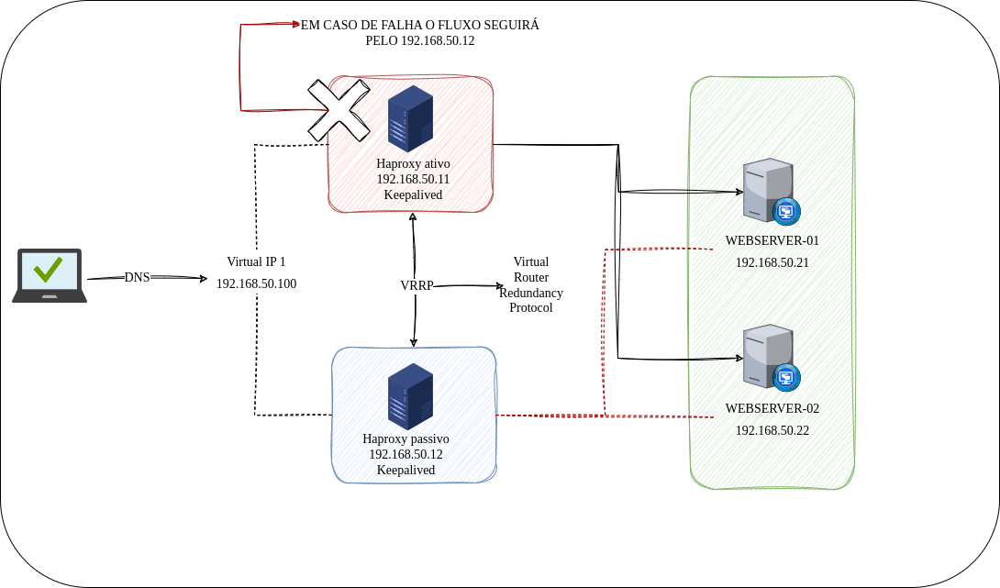

<h1 align="center">Haproxy e Keepalived</h1>

<p align="center">
  
  
</p>

<p align="center">
  <a href="#-projeto">Projeto</a>&nbsp;&nbsp;&nbsp;|&nbsp;&nbsp;&nbsp;
  <a href="#-tecnologias">Tecnologias</a>&nbsp;&nbsp;&nbsp;|&nbsp;&nbsp;&nbsp;
  <a href="#-ambiente">Ambiente</a>&nbsp;&nbsp;&nbsp;|&nbsp;&nbsp;&nbsp;
  <a href="#-etapas">Etapas</a>&nbsp;&nbsp;&nbsp;|&nbsp;&nbsp;&nbsp;
  <a href="#-licença">Licença</a>&nbsp;&nbsp;&nbsp;|&nbsp;&nbsp;&nbsp;
  <a href="#-referências">Referências</a>
</p>

<p align="center">
  
</p>

## 🌱 Projeto
- Loadbalancer com Haproxy

## ✨ Tecnologias

- Virtualbox
- Vagrant
- Ansible
- Haproxy
- Keepalived
- Nginx

## 🗒 Ambiente

- [x] [Criar chave ssh para o projeto](./keys/)
- [x] [Criar um vagrantifile para subir dois servidores para o Haproxy e dois para o Webserver com Nginx](./vagrantfile)
- [x] [Criar playbook para automatizar as seguintes tarefas](./site.yaml)
    - [x] [Configuração dos Hosts](./roles/configure_hosts/)
        - [x] Instalar docker
        - [x] Instalar containerd
        - [x] Criar usuários e grupos
        - [x] Jogar a chave ssh pública do usuárion para dentro da vm
    - [x] [Instalar e configurar 2 webserver Nginx](./roles/configure_webserver/)
        - [x] Criar arquivo ngin.conf simples
        - [x] Criar um index.html simples
    - [x] Instalar e Configurar o Haproxy
    - [x] Instalar e configurar o Keepalived

## 🚀 Etapas

1. Role para configuração dos Hosts

```bash
ansible-playbook -i inventory/virtualbox.yaml site.yaml --tags setup
```

2. Role para instalação e configuração dos webservers

```bash
ansible-playbook -i inventory/virtualbox.yaml site.yaml --tags web
```

3. Role para Instalação/configurar do Haproxy

```bash
ansible-playbook -i inventory/virtualbox.yaml site.yaml --tags install
```

4. Role para configurar o haproxy e instalar/configura o Keepalived

```bash
ansible-playbook -i inventory/virtualbox.yaml site.yaml --tags configure
```

## 📄 Licença
Esse projeto está sob a licença MIT. Veja o arquivo [LICENSE](LICENSE) para mais detalhes.

## 🙇 Referências